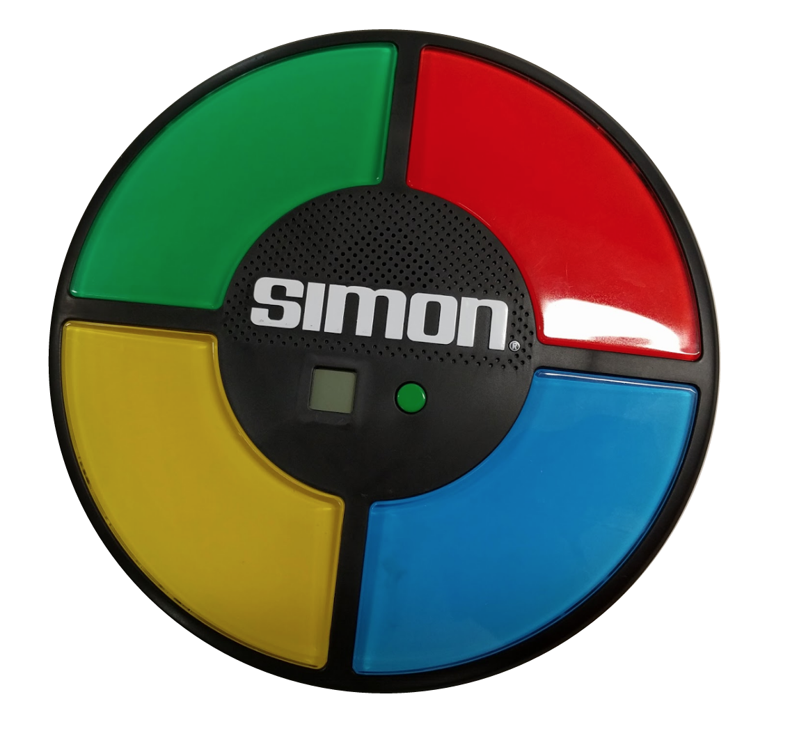
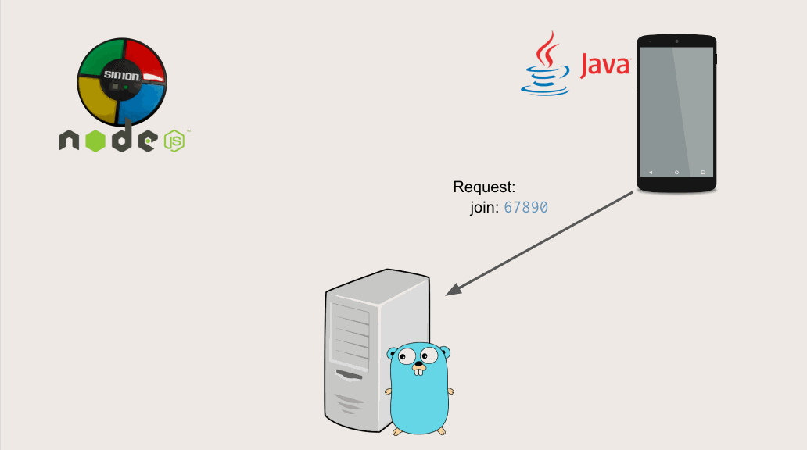

# Multiplayer Simon Says - A Game using gRPC and Kubernetes.

This is an example project using [gRPC](http://www.grpc.io/) and [Kubernetes](http://kubernetes.io/) to build a multiplayer version
of the game "Simon Says".

It has been implemented in multiple languages to highlight the variety of supported languages that gRPC
gives you out of the box.

## Folder Structure

- /server
This is the directory for the server implementation
    - [/go](/server/go)  
        An example server implementation using [Go](https://golang.org/) and [Redis](http://redis.io/)
- /client  
  Client implementations written in a variety of languages and platforms
    - [/java-android](/client/java-android)  
    Client implementation for [Android](https://developer.android.com/studio/index.html) written in [Java](http://java.com).
    - [/node-arduino](/client/node-arduino)  
    Client impementation in [Node.js](https://nodejs.org/) for [Arduino](https://www.arduino.cc/)
    - [/node-web](/client/node-web)  
    Clent implementation in [Node.js](https://nodejs.org/) and [Javascript](https://www.javascript.com/) for the browser.

## gRPC Communication

The following animation shows the way in which gRPC sends message over it's bidirectional streaming
connection, to enable gameplay.

Here we can see:

- Two players on different devices joining the game,
- Being notified it is their turn
- Communicating a button press on their clients
- Being told to light up given colors
- When the game has ended, because a sequence is incorrect
- Who has won the game in the end

## Presentation Recordings

  
[Ubiquity Dev Summit](https://ubiquity.withgoogle.com/), 2016

## Contributing changes

* See [CONTRIBUTING.md](CONTRIBUTING.md)

## Licensing

* See [LICENSE](LICENSE)

*This is not an official Google Product.*
