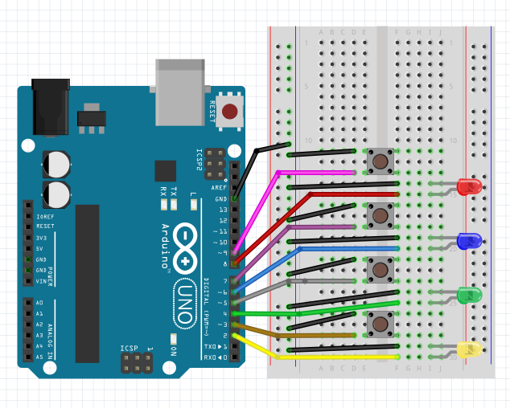

# Arduino Client for gRPC Simon

This is an implementation of the gRPC Simon client in Node.js that uses an Arduino as the input method.
It uses Johnny-Five to communicate with the Arduino over a serial connection (USB/Bluetooth/etc).

A normal Arduino cannot run Node.js, you need to plug the Arduino into a machine that can run Node.js. This can be a laptop, Raspberry Pi and friends, or an Arduino compatible Linux machine (Arduino Yún, Intel Edison, etc)

## How to deploy
- Set up your Arduino with the buttons and LEDs
  - 
- Plug in your Arduino to the USB port and make sure it is detected by your computer
- Flash your Arduino with [Firmata](http://johnny-five.io/platform-support/#arduino-uno)
- Shut down any program using the Arduino (like the Arduino IDE)
- Install dependencies
   - ```make install```
- Run:
     - ```make run SERVERIP=<server-ip-here>```

Notes:
- This is not an official Google product
- Only tested on OSX and Linux (Ubuntu)
  - If you test on Windows, let us know! Pull requests welcome.